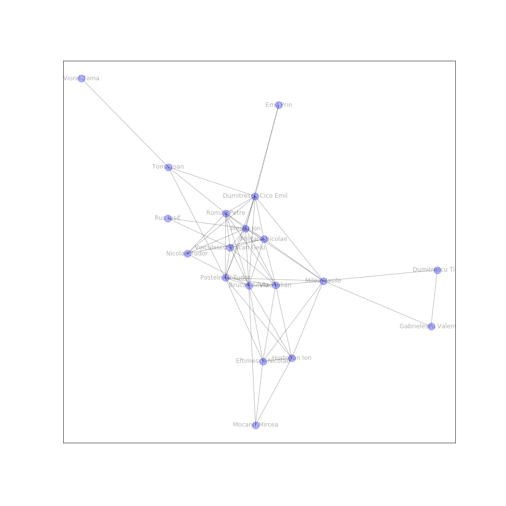

(work in progress)
# Analytics on the Indictment of the Romanian 1989 Revolution Trial

After more than 30 years, the Romanian 1989 Trial has started. A 198 pages short version of the Indictment has been made publicly available in pdf format. I have performed some analytics on the document

* __graph.ipynb__ is a  social graph approach. The nodes represent the people mentioned within the document, and the edge values are the number of co-occurences of each pair of characters (defendants, suspects, etc) in a paragraph.

The idea is that if characters A and B are mentioned together in a paragraph, it means they have done something together or, at least, there is a factual connection.

Visually, the graph looke like 

The more connected to others a character is, the closer to the center of the graph it is represented. To get a better view of the the importance of each character, the pagerank of the nodes is computed. The biggest ranks are:

| Name                   | Rank      | 
| :--------------------- |:---------:| 
| Iliescu Ion            | 0.140757  | 
| Militaru Nicolae       | 0.116794  |  
| Voiculescu Voican Gelu | 0.099276  | 
| Brucan Silviu          | 0.089093  | 

As expected, The dedenfant Iliescu has the greatest rank, but I was surprised to find that Silviu Brucan played a bigger role than others like Cico Dumitrescu.

From the community point of view, the graph separates in two communities, one with Ceausescu's regime characters like iulian Vlad, Tudor Postelnicu and the second with the ones taking the power after the 22nd of December.

